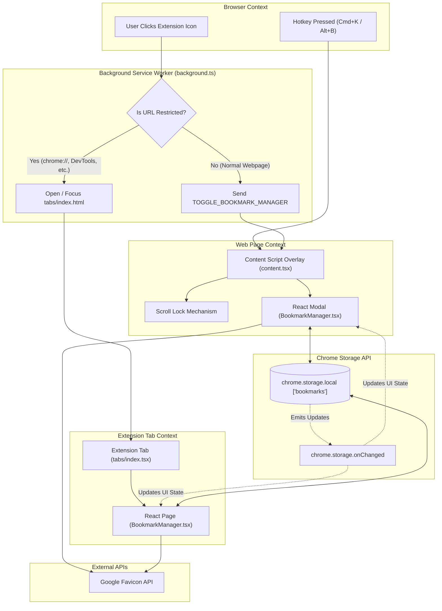
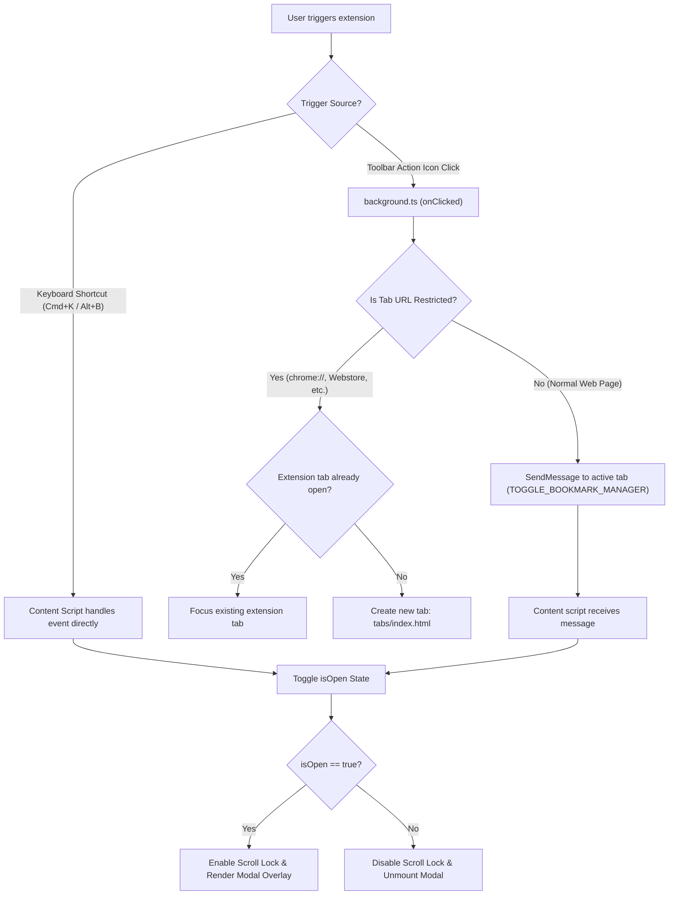
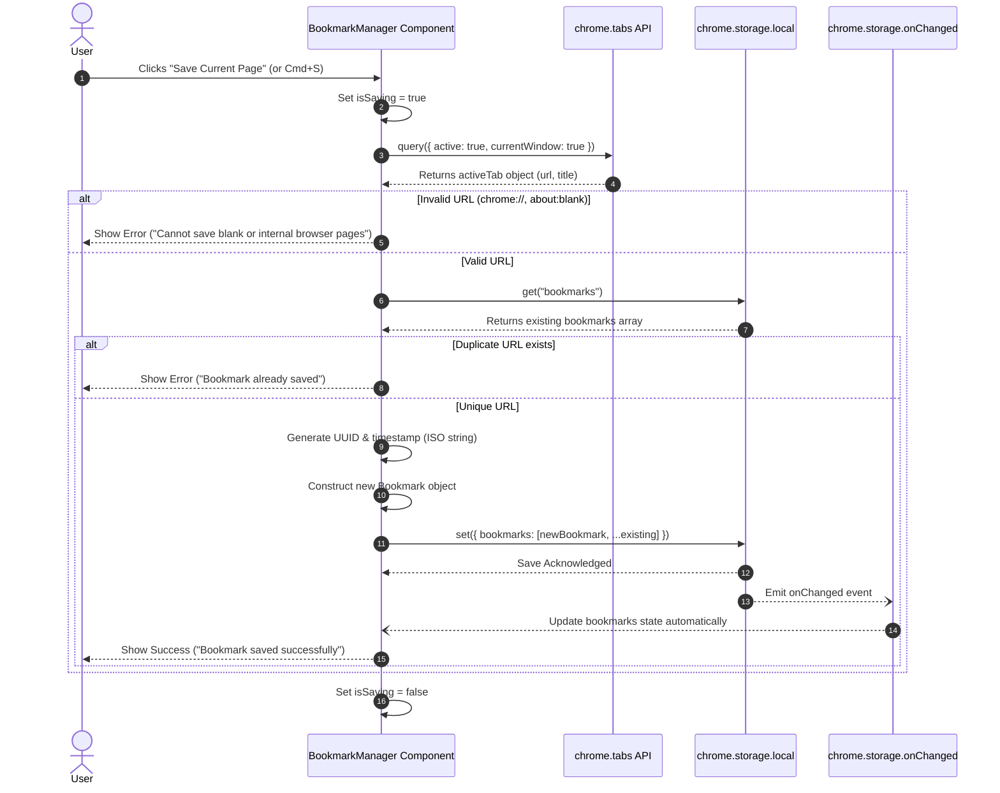
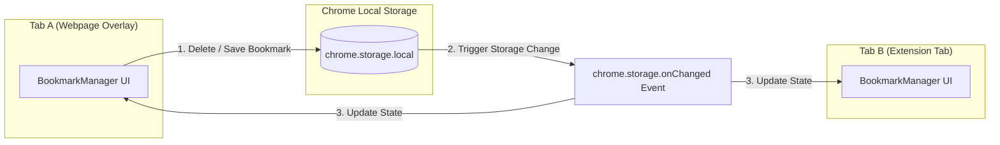

# Extension Architecture & Data Flow Guide

This document provides a detailed breakdown of the **Bookmark Manager Chrome Extension** architecture, user interaction flows, data pipeline, component hierarchy, and real-time synchronization mechanisms.

---

## 🗺️ System Architecture Overview

The extension is built using **Plasmo (Manifest V3)**, **React**, **TypeScript**, and **Tailwind CSS**. It operates across three distinct Chrome extension execution contexts:

1. **Background Service Worker ([background.ts](file:///c:/Users/ASUS/Desktop/Projects/bookmark-manager/bookmark-manager/background.ts))**: Background event hub handling extension clicks, tab URL inspection, and context routing.
2. **Content Script Overlay ([content.tsx](file:///c:/Users/ASUS/Desktop/Projects/bookmark-manager/bookmark-manager/content.tsx))**: Injected into web pages to display an in-page glassmorphism overlay modal.
3. **Standalone Extension Tab ([tabs/index.tsx](file:///c:/Users/ASUS/Desktop/Projects/bookmark-manager/bookmark-manager/tabs/index.tsx))**: Full-page tab fallback when operating on restricted browser pages where content scripts cannot run.
4. **Storage Layer (`chrome.storage.local`)**: Central persistent storage for user bookmarks with real-time change events.



---

## ⚡ Extension Launch & Context Routing Flow

When the user triggers the extension, the background worker determines whether to launch the overlay inside the active tab or direct the user to a standalone tab.

### Flow Logic:
1. User clicks the extension action icon in the Chrome toolbar.
2. `background.ts` receives `chrome.action.onClicked`.
3. Checks if the active tab is already the extension tab or a restricted browser URL (`chrome://`, `edge://`, `about:`, `chrome.google.com/webstore`).
4. **If Restricted Page**: Creates or switches to `tabs/index.html`.
5. **If Normal Webpage**: Sends runtime message `{ type: "TOGGLE_BOOKMARK_MANAGER" }` to `content.tsx`.



---

## 💾 Data Flow: Saving a Bookmark

Saving a bookmark involves active tab querying, URL validation, duplicate checking, UUID generation, local storage persistence, and real-time state synchronization.



---

## 🔄 Real-Time Storage Synchronization Flow

Because bookmarks can be saved or deleted from multiple tabs or overlay instances, the extension utilizes `chrome.storage.onChanged` to maintain synchronized state across all active contexts.



---

## 🧩 Component Hierarchy & Responsibilities

```
BookmarkManager (Container & State Controller)
├── Header (Title, Item Counter Badge, Close Button)
├── SearchBar (Search input with clear button & ⌘K shortcut trigger)
├── Category Tabs ("All" / "Recent" filter buttons)
├── Main Content Area
│   ├── Loading State (Spinner)
│   ├── Error Banner (Load / Delete Error alert)
│   ├── EmptyState ("No bookmarks yet" / "No search results")
│   └── BookmarkGrid (2-column responsive layout, grid scrollbar)
│       └── BookmarkCard (Framer Motion card, Google Favicon API, Delete confirm)
└── Footer (Local sync status badge, Esc key legend)
```

| Component | File Link | Responsibilities |
| :--- | :--- | :--- |
| **BookmarkManager** | [BookmarkManager.tsx](file:///c:/Users/ASUS/Desktop/Projects/bookmark-manager/bookmark-manager/components/BookmarkManager.tsx) | Handles state management, Chrome storage read/write, filtering, and tab switching. |
| **BookmarkCard** | [BookmarkCard.tsx](file:///c:/Users/ASUS/Desktop/Projects/bookmark-manager/bookmark-manager/components/BookmarkCard.tsx) | Displays bookmark tile, fetches domain favicon, relative time calculation, tab opening, delete confirmation state. |
| **BookmarkGrid** | [BookmarkGrid.tsx](file:///c:/Users/ASUS/Desktop/Projects/bookmark-manager/bookmark-manager/components/BookmarkGrid.tsx) | Grid layout with `AnimatePresence` for smooth exit/entrance animations. |
| **Header** | [Header.tsx](file:///c:/Users/ASUS/Desktop/Projects/bookmark-manager/bookmark-manager/components/Header.tsx) | Displays branding, count badge, and trigger close callback. |
| **SearchBar** | [SearchBar.tsx](file:///c:/Users/ASUS/Desktop/Projects/bookmark-manager/bookmark-manager/components/SearchBar.tsx) | Controlled input for real-time title & URL filtering. |
| **EmptyState** | [EmptyState.tsx](file:///c:/Users/ASUS/Desktop/Projects/bookmark-manager/bookmark-manager/components/EmptyState.tsx) | Renders contextual empty screens for 0 bookmarks vs 0 search results. |
| **dateUtils** | [dateUtils.ts](file:///c:/Users/ASUS/Desktop/Projects/bookmark-manager/bookmark-manager/utils/dateUtils.ts) | Utility logic for converting ISO timestamps to relative strings (e.g. `Saved 5m ago`). |

---

## 🔒 Scroll Lock Mechanism ([content.tsx](file:///c:/Users/ASUS/Desktop/Projects/bookmark-manager/bookmark-manager/content.tsx))

When the overlay modal opens on a webpage, `content.tsx` prevents background page scrolling while retaining internal scrollability within the bookmark grid:

1. **Locks page overflow**: Sets `document.body.style.overflow = "hidden"` and `document.documentElement.style.overflow = "hidden"`.
2. **Intercepts Wheel & Touch Events**: Captures `wheel` and `touchmove` events at the window level.
3. **Checks Event Target Path**: Inspects `e.composedPath()` for elements containing `.grid-scrollbar`.
4. **Conditional Prevention**: If the event originated outside the scrollable grid container, `e.preventDefault()` is called to prevent background page movement.
